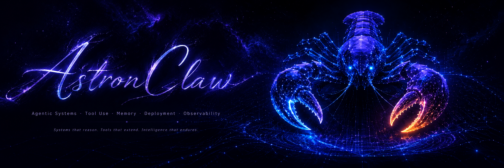
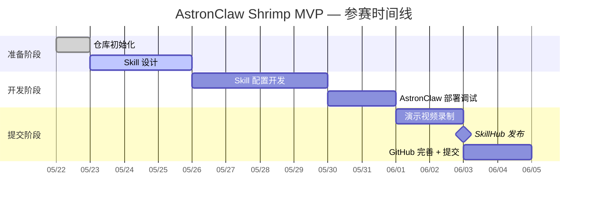
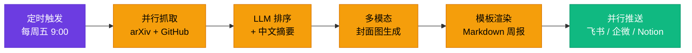

<p align="center">
  <h1 align="center">AstronClaw Shrimp MVP</h1>
  <p align="center"><strong>讯飞 AstronClaw 养虾挑战赛参赛作品 · 端云一体 AI Agent 极简 MVP</strong></p>
</p>

<p align="center">
  
</p>

<p align="center">
  
  
  
  
  
</p>

<p align="center">
  <a href="#-highlights-亮点聚焦">Highlights</a> ·
  <a href="#-origin-起源">Origin</a> ·
  <a href="#-judge-判断">Judge</a> ·
  <a href="#-progress-进程">Progress</a> ·
  <a href="#-repo-structure-仓库结构">Repo-Structure</a> ·
  <a href="#️-workflow-工作流">Workflow</a> ·
  <a href="#-skills-技能清单">Skills</a> ·
  <a href="#-hackathon-参赛信息">Hackathon</a> ·
  <a href="#️-roadmap-规划">Roadmap</a> ·
  <a href="#-link-关键链接">Link</a> ·
  <a href="#-thanks-to-sponsors-合作赞助方鸣谢">Thanks</a> ·
  <a href="#-privacy-隐私提醒">Privacy</a>
</p>

---

## ✨ Highlights (亮点聚焦)

> 围绕 Agent 设计五要素 **`Agentic Systems · Tool Use · Memory · Deployment · Observability`**
> 构建完整闭环 —— AI 不止「会说」，更要**能做、能记、能改**。

| 维度 | weekly-digest 的实现 |
|------|----------------------|
| 🦞 **Agentic Systems** | 5 步流水线全自动：定时触发 → 多源抓取 → AI 排序 → 多模态产出 → 多渠道分发 |
| 🛠️ **Tool Use** | 单 Skill 内并发调用 4 类外部 API：arXiv + GitHub + 飞书/企微 + Notion |
| 🧠 **Memory** | 周报写入 Notion 数据库 → Agent 读过的内容成为下一期排序输入，复利式优化 |
| 🚀 **Deployment** | AstronClaw 原生 cron + SkillHub 一键发布，沙箱隔离，1 分钟上线 |
| 📊 **Observability** | 指数退避重试 3 次 + 步骤级日志 + 失败时飞书告警，生产级可靠性 |

> 📦 **平台底座**：讯飞 AstronClaw 端云一体 Agent 平台 · 零代码 YAML · 国家信息安全三级认证沙箱 · 多模态原生支持

---

## 🌱 Origin (起源)

> _2026 年春，高校硅谷 - AstronClaw 创想挑战赛启动。_

科大讯飞推出的 **AstronClaw**（俗称「养虾」）是 2026 年重点发布的端云一体 AI Agent 平台，
本仓库是参与该挑战赛的极简 MVP 作品 —— **不追求功能堆砌，专注「能跑、能演示、能复现」**。

参赛目标：

1. 演示 AstronClaw 平台的**一键部署**与**沙箱执行**能力
2. 验证一个真实的 AI Agent 闭环（输入 → 决策 → 执行 → 反馈）
3. 发布到官方 **SkillHub**，参与社区评价与传播

---

## 💡 Judge (判断)

> 参赛 MVP 不是产品，是技术判断的载体。以下是本项目坚持的设计原则。

| 原则 | 选择 | 拒绝 |
|------|------|------|
| **形态** | 端云一体 Agent | 纯本地 Demo |
| **部署** | 一键部署 + SkillHub | 私有部署 + 闭源 |
| **交互** | 多模态（含 RPA 执行） | 纯对话框 |
| **安全** | 平台沙箱 + 三级认证 | 本地越权 |
| **传播** | 公开仓库 + 演示视频 | 闭门作品 |

**核心判断**：评审给分看的是「真的能跑 + 真的有人用」，不是功能列表。

---

## 📊 Progress (进程)



| 📊 阶段 | 状态 | 备注 |
|:----:|:----:|------|
| 仓库骨架 | ✅ 完成 | README / docs / skills / LICENSE |
| Skill 设计 | ✅ 完成 | git-commit-guide / cascade-maintain 已就位 |
| Skill 配置开发 | 🟡 进行中 | `weekly-digest.yaml` 已落地，待沙箱跑通 |
| 部署调试 | ⚪ 未开始 | — |
| 演示资料 | ⚪ 未开始 | 视频 + GIF + 截图 |
| SkillHub 发布 | ⚪ 未开始 | — |

---

## 📂 Repo-Structure (仓库结构)

```text
astronclaw-shrimp-mvp/
├── README.md                  # 项目首页（你正在看的）
├── deploy.md                  # AstronClaw 一键部署教程
├── .env.example               # 环境变量样例
├── .gitignore                 # Git 忽略规则
├── LICENSE                    # MIT 开源协议
├── assets/
│   └── banner.png             # README Banner 图
├── docs/
│   ├── 技术报告.md             # 详细实现思路与技术栈
│   ├── 演示视频.md             # 视频外链
│   └── 效果截图/               # 静态截图
├── skills/                    # AstronClaw Skill 配置（.yaml / .json）
│   └── weekly-digest.yaml     # 学术周报自动化 Skill（首个 MVP）
├── screenshots/               # 演示 GIF 与运行截图
└── .claude/
    └── skills/                # Claude Code 工作流 skill
        ├── git-commit-guide/  # Git 提交规范
        └── cascade-maintain/  # 索引联动维护
```

<details>
<summary>📌 关键文件说明</summary>

- `skills/` —— 上传到 AstronClaw 控制台的 Skill 配置文件
- `.claude/skills/` —— 本地开发协作规范，不参与 AstronClaw 部署
- `.env.example` —— 仅占位，真实密钥放本地 `.env`，**严禁提交**
- `docs/技术报告.md` —— 评审重点参考

</details>

---

## ⚙️ Workflow (工作流)


### git-commit-guide (Git 提交规范)

参赛专属提交类型：`skill` / `deploy` / `demo` / `docs` / `polish` / `feat` / `fix` / `refactor` / `chore` / `init`。
格式 `<type>(<scope>): <subject>`，scope 写 Skill 名或模块名，详见
[.claude/skills/git-commit-guide/SKILL.md](./.claude/skills/git-commit-guide/SKILL.md)。

### cascade-maintain (索引联动维护)

改动 Skill / 部署 URL / 演示资料 / 技术架构 任一处，自动检测并同步下游 README / deploy.md /
技术报告 / `.env.example`，杜绝「Skill 改了但 README 链接没换」的常见疏漏。
详见 [.claude/skills/cascade-maintain/SKILL.md](./.claude/skills/cascade-maintain/SKILL.md)。

### 一键部署

详细 7 步教程见 [`deploy.md`](./deploy.md)。

---

## 🦞 Skills (技能清单)

| Skill | 版本 | 状态 | 文件 | 说明 |
|---|:---:|:---:|---|---|
| **weekly-digest** | 0.1.0 | 🟡 调试中 | [`skills/weekly-digest.yaml`](./skills/weekly-digest.yaml) | 每周自动抓取 arXiv + GitHub Trending → AI 排序排版 → 飞书 / 企微 / Notion 推送 |

### weekly-digest 流水线（首个落地 Skill）



**为什么是这个方向**：把 AstronClaw 的「**调度 + 多模态 + 沙箱执行 + 多渠道 RPA**」全部卖点串成闭环，
比单纯的"AI 问答 Demo"更能体现端云一体 Agent 平台价值。

---

## 🏆 Hackathon 参赛信息

| 项目 | 内容 |
|------|------|
| **赛事名称** | 高校硅谷 - AstronClaw 创想挑战赛（养虾挑战赛） |
| **主办方** | 科大讯飞 iFLYTEK AI 开发者生态 |
| **作品类别** | 端云一体 AI Agent MVP |
| **提交日期** | 2026-05 |
| **官方社区** | [讯飞开发者社区](https://developer.xfyun.cn/) |
| **作者** | _待填写_ |

> 一键部署链接与 SkillHub 发布地址在开发完成后回填到本节顶部徽章组。

---

## 🗺️ Roadmap (规划)

- [x] **v0.0** — 仓库骨架 + Skill 规范（git-commit / cascade-maintain）
- [x] **v0.1** — 首个 Skill `weekly-digest` 配置完成（学术周报闭环）
- [ ] **v0.2** — `weekly-digest` 沙箱跑通 + 飞书首次真实推送
- [ ] **v0.3** — 录制演示视频 + 补充封面图 multimodal 调优
- [ ] **v1.0** — SkillHub 公开发布 + 演示视频上线 + 提交参赛

---

## 🔗 Link (关键链接)

| 类型 | 链接 |
|------|------|
| 📺 演示视频 | _待填写_（Bilibili 主推） |
| 🚀 一键部署 | _待填写_（AstronClaw 控制台 URL） |
| 📱 部署二维码 | `screenshots/deploy_qrcode.png` |
| 🦞 SkillHub Skill | _待填写_ |
| 📖 技术报告 | [`docs/技术报告.md`](./docs/技术报告.md) |
| 🛠️ 部署教程 | [`deploy.md`](./deploy.md) |
| 🏛️ 官方比赛 | [challenge.xfyun.cn](https://challenge.xfyun.cn) |
| 👨‍💻 开发者社区 | [developer.xfyun.cn](https://developer.xfyun.cn/) |

---

## 🤝 Thanks to Sponsors (合作赞助方鸣谢)

- **科大讯飞 iFLYTEK** —— AstronClaw 平台提供方与赛事主办
- **AstronClaw SkillHub** —— Skill 发布与社区评价基础设施
- **高校硅谷** —— 创想挑战赛联合举办方

---

## 🔒 Privacy (隐私提醒)

- ⚠️ **`.env` 严禁提交** —— 所有 API Key / Webhook URL 仅放本地，仓库公开
- ⚠️ **commit message 中不出现密钥** —— 即便只是占位也不行
- ⚠️ **演示视频脱敏** —— 录制时遮挡个人手机号、邮箱、Token
- ⚠️ **SkillHub 内容合规** —— 不涉及政治敏感 / 暴力 / 低俗，违规直接淘汰
- ⚠️ **沙箱不越权** —— 不尝试本地文件读写、敏感系统 API，违规可能封号

---

<p align="center">
  <sub>Built with 🦞 AstronClaw · Powered by 讯飞 iFLYTEK · MIT License © 2026</sub>
</p>
